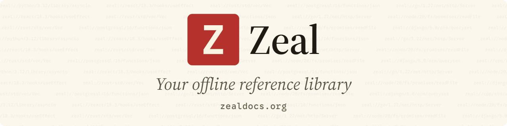

<picture>
  <source media="(prefers-color-scheme: dark)" srcset="banner-dark.png">
  
</picture>

Zeal is a free, open-source offline documentation browser for Linux and Windows: your personal reference library,
searchable in an instant and available without a connection.

[Website](https://zealdocs.org) · [Download](https://zealdocs.org/download) ·
[Discord](https://go.zealdocs.org/l/discord) · [Telegram](https://go.zealdocs.org/l/telegram) ·
[X](https://go.zealdocs.org/l/x)
